# Task It configuration guide

Use our admin console to customize Task It to your organization's needs. We save new and updated configuration details from the admin console in the Task It API.

<figure markdown="span">
  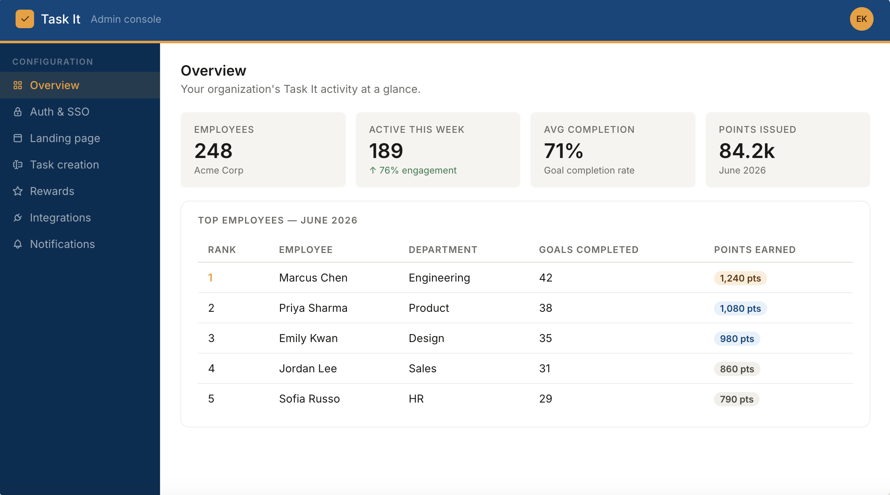
  <figcaption>Admin console overview</figcaption>
</figure>

## Authentication required

Set up your preferred identity provider (IdP), choose an authentication protocol, and optionally set up Single Sign-On (SSO) to protect user data.

<figure markdown="span">
  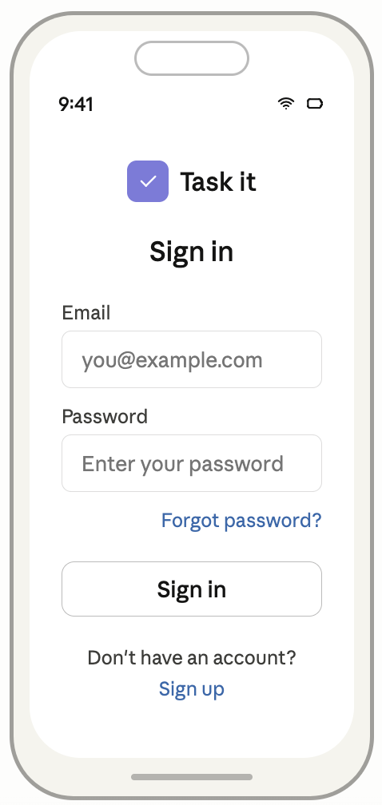
  <figcaption>Task It accounts authentication method</figcaption>
</figure>

<figure markdown="span">
  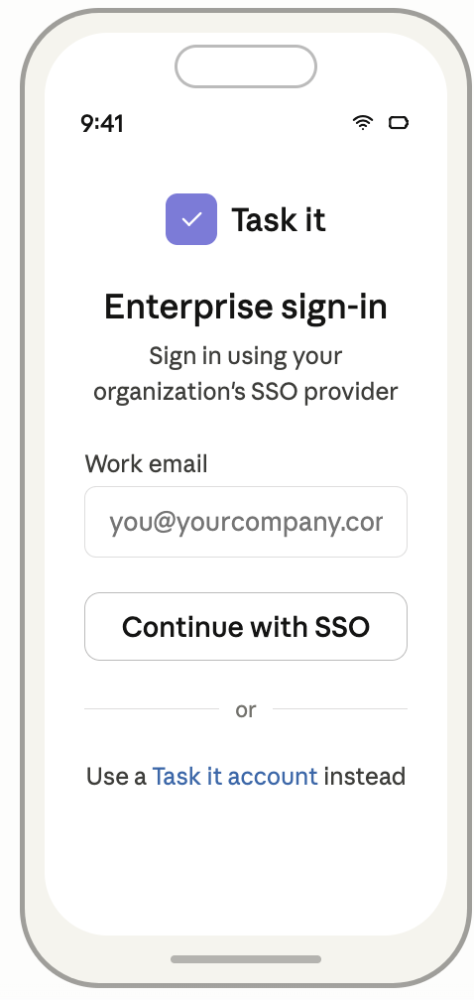
  <figcaption>Enterprise Single Sign-On SSO authentication method</figcaption>
</figure>

### Configuration details

<figure markdown="span">
  
  <figcaption>Authentication configuration</figcaption>
</figure>

Select **Auth & SSO** to configure the following components:

| **Component** | **Configuration details** | **Default** |
| --- | --- | --- |
| Method required | Select one of the following authentication methods (how users log into the Task It application): **Task It account:** Users create a Task It username and password. **Enterprise SSO:** Users log into Task It use their existing company credentials and your existing Identity Provider (IdP). | Task It account |
| Protocol optional | If you select the Enterprise SSO authentication method, you must also select one of the following protocols: OpenID Connect (OIDC) recommended Security Assertion Markup Language (SAML) | OIDC |
| Session timeout required | We log users out of the Task It application if they're inactive for a set period of time. Select one of the following session timeout options: 1 hour 4 hours 8 hours | 1 hour |

## Landing page required

The main screen displaying a user's in-progress tasks, goals, and rewards.

<figure markdown="span">
  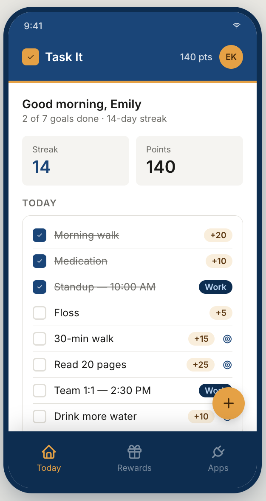
  <figcaption>Task It landing page</figcaption>
</figure>

### Configuration details

<figure markdown="span">
  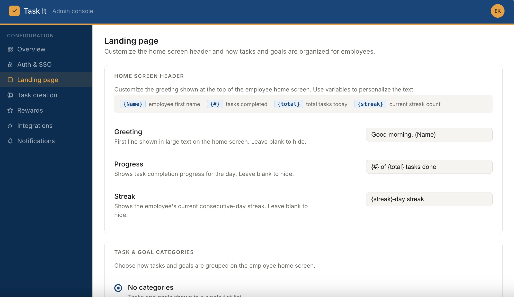
  <figcaption>Landing page configuration</figcaption>
</figure>

Select **Landing page** to configure the following components:

| **Component** | **Configuration details** | **Default** |
| --- | --- | --- |
| Greeting message optional | Displayed at the top of the landing page. The message includes a combination of: Copy (configurable) First name using the {name} variable (not configurable) If you don't configure a greeting message, we don't display it. | Good morning, {name} |
| Progress message optional | Displayed following the greeting to show a user's daily task progress. The message includes a combination of: Copy (configurable) Number of tasks the user completed today using the {#} variable (not configurable) Total number of tasks the user needs to complete today using the {total} variable (not configurable) If you don't configure a progress message, we don't display it. | {#} of {total} tasks done |
| Streaks optional | A card illustrating how many consecutive days a user has been active in the application. Configuration options: On Off | On |
| Streaks message optional | Displayed following the greeting to show a user's streak progress. The message includes a combination of: Copy (configurable) Number of days the user has been active in the application using the {streak} variable (not configurable) If you don't configure a streaks message, we don't display it. | {streak}-day streak |
| Category optional | You can organize tasks into one of the following categories: **Time-based:** Today, Tomorrow, Next 7 days, Next 30 days **Theme:** Work, Personal, Health **No categories:** Flat list | Time-based |

## Task creation required

The flow that guides users through creating a new task and setting details such as name, category, and recurrence rules (daily, weekly, or one-time). Users can also connect a task to an ongoing, time-bound goal.

<figure markdown="span">
  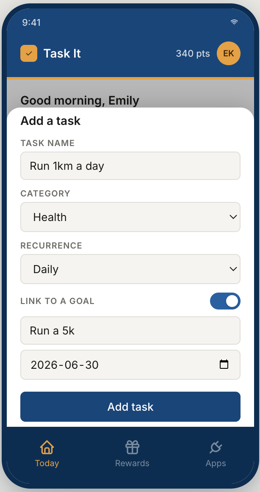
  <figcaption>Creating a new task, linked to a goal</figcaption>
</figure>

### Configuration details

<figure markdown="span">
  
  <figcaption>Task creation configuration</figcaption>
</figure>

You can configure the following components from the 

| **Component** | **Configuration details** | **Default** |
| --- | --- | --- |
| Task Limits required | You can configure the maximum number of tasks a user is allowed to create. If you don't want a limit, leave this field blank. | No limit |
| Heading optional | Displayed at the top of the task creation modal. If you don't configure a heading, we don't display it. | Add a task |
| Labels required | You can configure labels preceding the following sections: Task name input Category dropdown Recurrence dropdown Goal toggle | **Task name input label:** Task name **Category dropdown label:** Category **Recurrence dropdown label:** Recurrence **Goal toggle label:** Link to a goal |
| Placeholder copy optional | Text displayed in the task and goal name input fields. This text disappears when a user starts typing. If you don't configure placeholder copy, we don't display it. | e.g. Drink 8 glasses of water e.g. Run a 5K |
| Call-to-action (CTA) copy required | When a user selects the CTA, we create the task and add it to the landing page. | Add task |

## Rewards required

Users can earn rewards (such as points) for completing tasks, and redeem their rewards for tangible incentives. 

<figure markdown="span">
  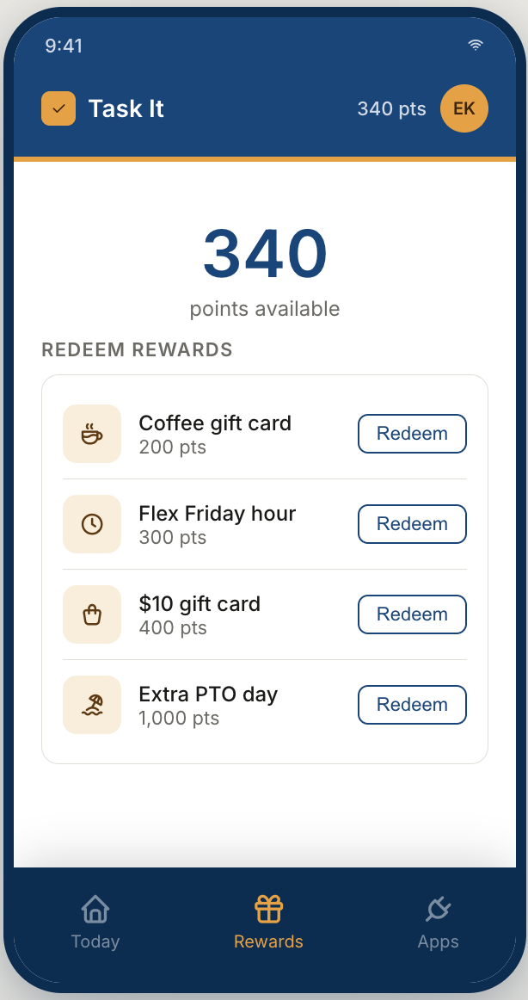
  <figcaption>A user's earned points and redeemable rewards</figcaption>
</figure>

### Configuration details

<figure markdown="span">
  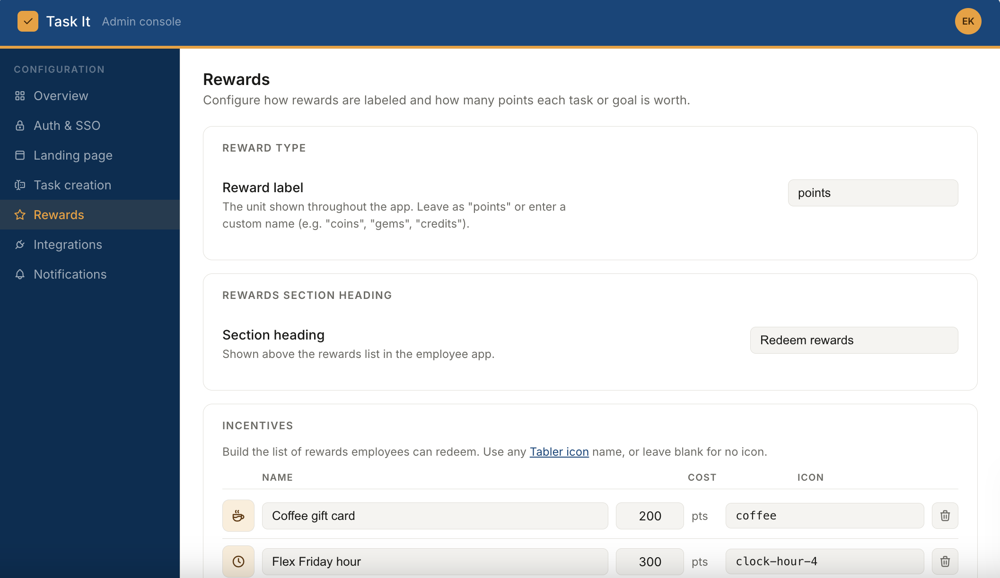
  <figcaption>Rewards configuration</figcaption>
</figure>

Select **Rewards** to configure the following components:

| **Component** | **Configuration details** | **Default** |
| --- | --- | --- |
| Type required | You can configure the type of rewards you want to you want to award users, depending on your rewards system. | Points |
| Value required | You can configure the rewards value tasks and goals are worth depending on the category users select (work, personal, or health). | **Work:** 250 **Personal:** 50 **Health:** 100 |
| Incentives required | The tangible rewards users can redeem. You can configure the following incentive details: Name required Cost required Icon optional | N/A |
| Section heading optional | Displayed preceding the incentives list. If you don't configure a section heading, we don't display it. | Redeem rewards |
| Button copy required | You can configure button copy for the following states: **Default:** The user has enough rewards to redeem for the incentive. **Redeemed:** The user redeemed the incentive. **Insufficient balance:** The user doesn't have enough rewards to redeem for the incentive. | **Default:** Redeem **Redeemed:** Redeemed **Insufficient balance:** Need more pts |

## Integrations optional

Allow users to sync Task It with with Google Calendar, Jira, and wearable devices for automatic task syncing and completion.

<figure markdown="span">
  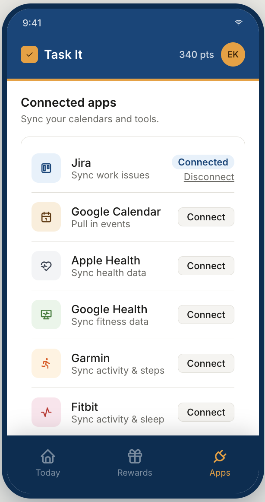
  <figcaption>A user's integration options</figcaption>
</figure>

### Configuration details

<figure markdown="span">
  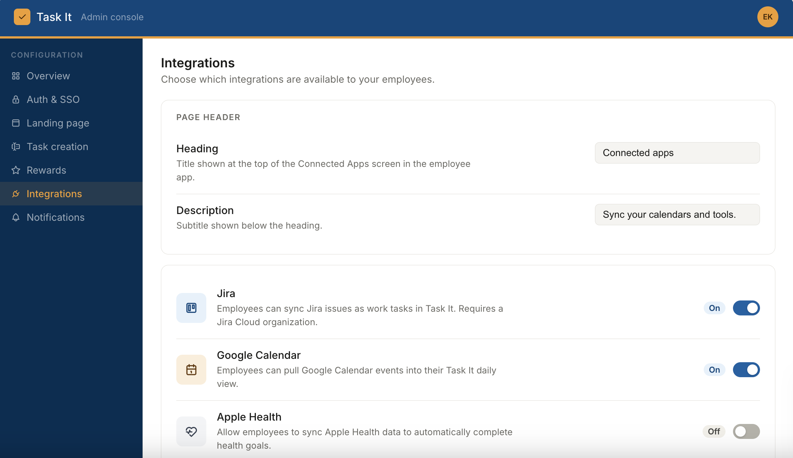
  <figcaption>Integration configuration</figcaption>
</figure>

Select **Integrations** to configure the following components:

| **Component** | **Configuration details** | **Default** |
| --- | --- | --- |
| Integration Options required | You can configure one or more the following integration options: Google Calendar Jira Apple Health Google Health Garmin Fitbit When you configure an integration option, users will see it in the application's "Apps" section. If a user connected an integration option and you delete it, we automatically disconnect it from their application. | Google Calendar Jira |
| Heading optional | Displayed at the top of the "Apps" screen. If you don't configure a heading, we don't display it. | Connected apps |
| Description optional | Displayed following the heading. If you don't configure a description, we don't display it. | Sync your calendars and tools. |

## Notifications optional

You can configure push notifications that remind users to complete upcoming tasks.

<figure markdown="span">
  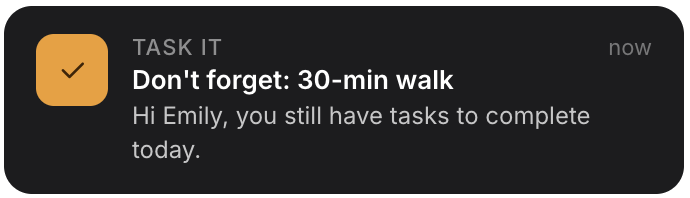
  <figcaption>Push notification reminder</figcaption>
</figure>

### Configuration details

<figure markdown="span">
  
  <figcaption>Notifications configuration</figcaption>
</figure>

Select **Notifications** to configure the following components:

| **Component** | **Configuration details** | **Default** |
| --- | --- | --- |
| Reminder timing required | You can choose one of two reminder timing options: **At a time:** Choose a time to send a push notification reminding users of incomplete tasks. **Before due date:** Select how many hours before a task is due to send a push notification reminding users of that day's incomplete tasks. | At a time, 5:00 PM |
| Copy required | You can configure a push notification title and body using a combination of copy and one or both of the following variables: {taskName} {firstName} | Don't forget: {taskName} Hi {firstName}, you still have tasks to complete today. |
